# 🎮 Projet Steam — Analyse du marché des jeux vidéo

## 📇 Contexte

Ce projet a été réalisé pour **Ubisoft**, un éditeur français de jeux vidéo souhaitant lancer un nouveau jeu sur Steam. L'objectif est de conduire une analyse globale du marché des jeux vidéo disponibles sur Steam afin de mieux comprendre l'écosystème et les tendances actuelles.

L'analyse a été réalisée avec **Databricks** et **PySpark** sur un dataset de ~55 000 jeux Steam.

---

## 📁 Structure du projet

```
projet-steam/
├── 01_loading_cleaning.ipynb       # Notebook 01 : Chargement & Nettoyage
├── 02_eda_analysis.ipynb           # Notebook 02 : EDA & Analyses
├── outputs/
│   └── images/                     # Visualisations exportées depuis Databricks
│       ├── 1_1_top_publishers.png
│       ├── 1_2_best_rated_games.png
│       ├── 1_3_releases_by_year.png
│       ├── 1_4_free_vs_paid.png
│       ├── 1_4_price_distribution.png
│       ├── 1_4_discount.png
│       ├── 1_5_top_languages.png
│       ├── 1_6_age_restriction.png
│       ├── 2_1_top_genres.png
│       ├── 2_2_genres_positive_ratio.png
│       ├── 2_3_publisher_genres.png
│       ├── 2_4_genres_price.png
│       ├── 3_1_platforms.png
│       ├── 3_2_genres_platforms.png
│       ├── 4_1_genres_evolution.png
│       ├── 4_2_price_vs_reviews.png
│       ├── 4_3_top_games_owners.png
│       └── 4_4_multiplatform.png
└── README.md
```

---

## 🗂️ Dataset

- **Source** : `s3://full-stack-bigdata-datasets/Big_Data/Project_Steam/steam_game_output.json`
- **Format** : JSON semi-structuré (imbriqué)
- **Volume** : ~55 691 enregistrements
- **Période couverte** : 1997 — 2023

---

## 🔧 Notebook 01 — Data Exploration & Cleaning

### Transformations appliquées

| Champ brut | Problème détecté | Traitement appliqué |
|---|---|---|
| `data.*` | JSON imbriqué | `col("data").getField("champ")` |
| `platforms.*` | Struct doublement imbriqué | `getField("platforms").getField("windows")` |
| `price` / `initialprice` / `discount` | String | `cast(Float)` |
| `release_date` | Multi-formats : `"2000/11/1"`, `"2019/01"`, `"2019"` | `try_to_date` + `coalesce` |
| `required_age` | String avec formats variés (`"MA 15+"`) | `regexp_extract(\d+)` + `cast(Int)` |
| `owners` | Plage texte `"0 .. 20,000"` | `regexp_extract` + `cast(Long)` |
| `positive` / `negative` | Entiers bruts | Ratio calculé : `positive / total_reviews` |
| `genre` | String multi-valeurs `"Action, Indie"` | `split()` → `explode()` |
| `languages` | String multi-valeurs | `split()` → `array_size()` + `explode()` |
| `categories` | `ArrayType` JSON | `explode()` direct |

### DataFrames créés et sauvegardés en Delta Tables

| Table | Description |
|---|---|
| `steam_games` | DataFrame principal nettoyé (~55 690 jeux) |
| `steam_genres` | Une ligne par genre (via `explode`) |
| `steam_languages` | Une ligne par langue (via `explode`) |
| `steam_categories` | Une ligne par catégorie (via `explode`) |
| `steam_platforms` | Format long Windows / Mac / Linux (via `stack`) |
| `steam_publishers` | Agrégations par éditeur |

---

## 📊 Notebook 02 — EDA & Analyses

### Partie 1 — Analyse Macro

#### 1.1 Top Publishers
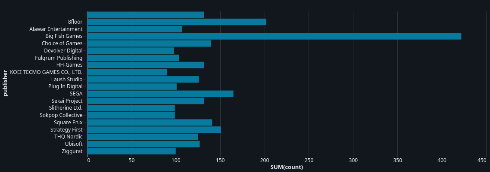

#### 1.2 Jeux les mieux notés
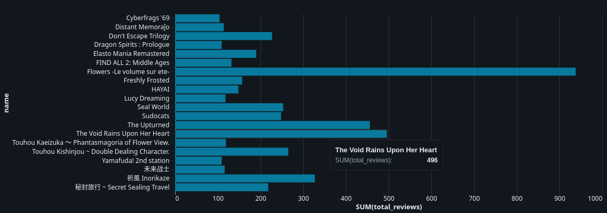

#### 1.3 Releases par année (Covid 2020-2021)
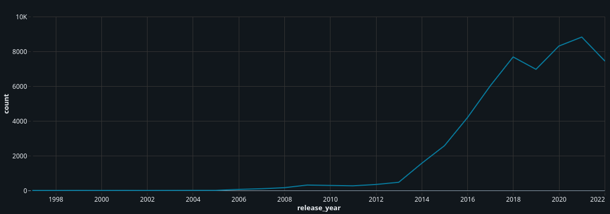

#### 1.4 Distribution des prix

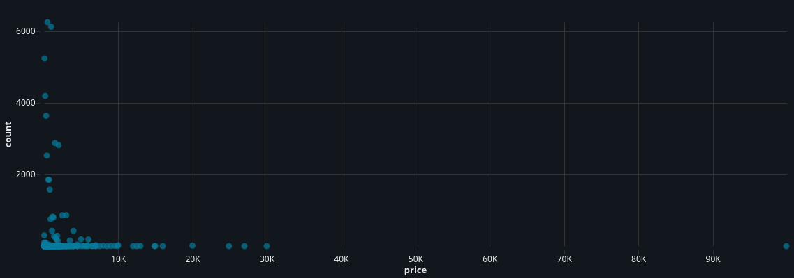
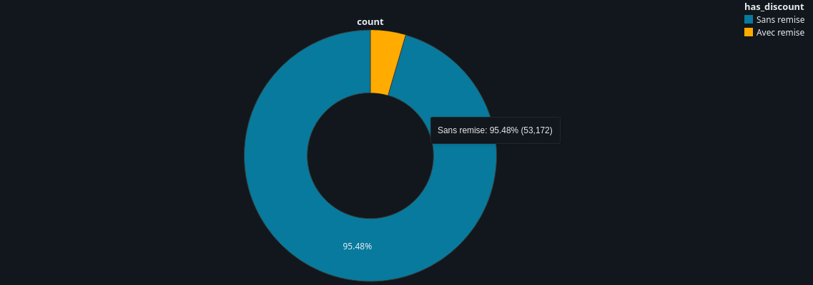

#### 1.5 Langues les plus représentées
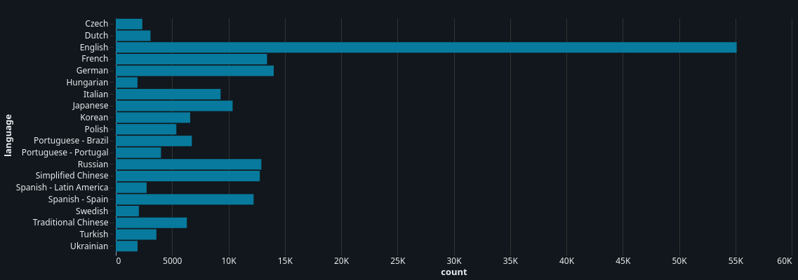

#### 1.6 Restrictions d'âge
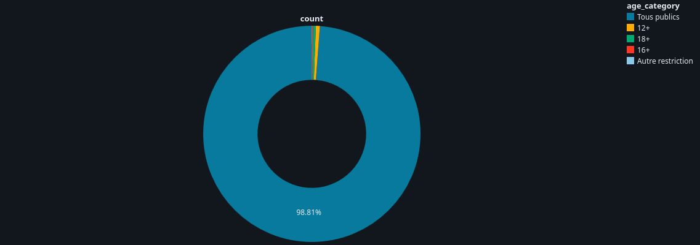

---

### Partie 2 — Analyse Genres

#### 2.1 Genres les plus représentés
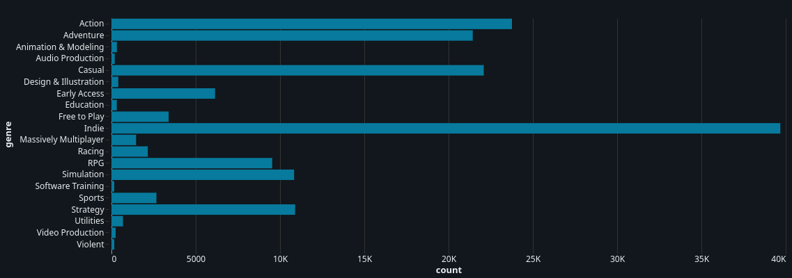

#### 2.2 Genres avec le meilleur ratio de reviews positives
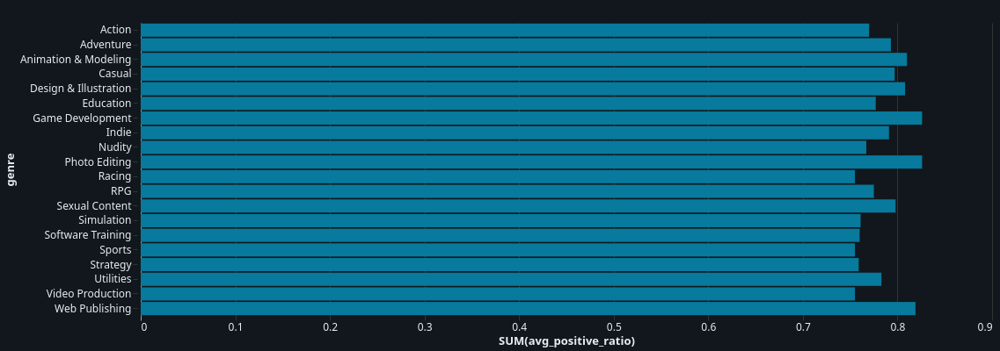

#### 2.3 Genres favoris par publisher
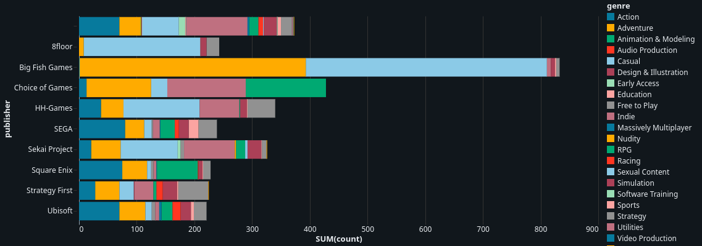

#### 2.4 Genres les plus lucratifs
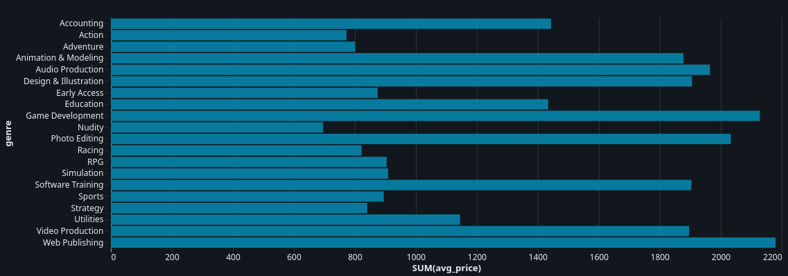

---

### Partie 3 — Analyse Plateformes

#### 3.1 Répartition Windows / Mac / Linux
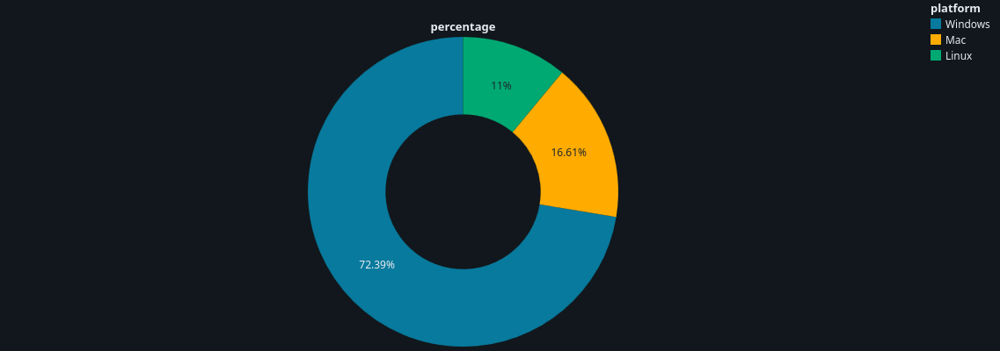

#### 3.2 Genres par plateforme
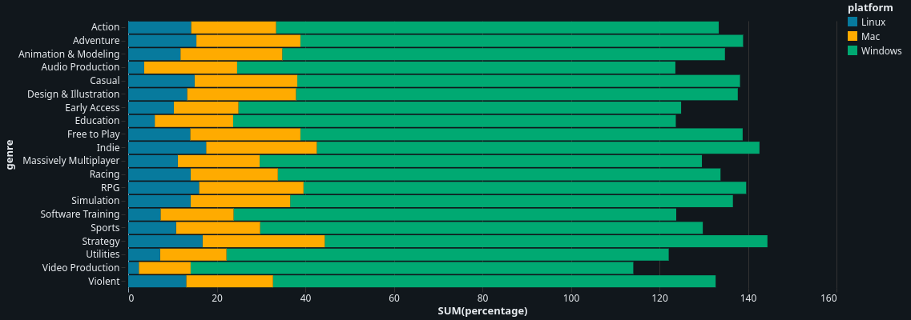

---

### Partie 4 — Analyses Complémentaires

#### 4.1 Evolution des genres dans le temps
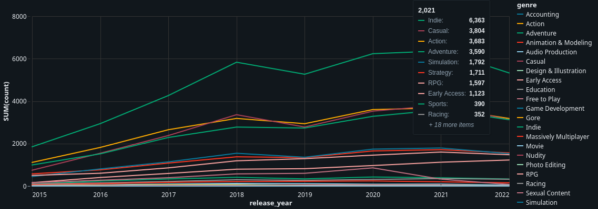

#### 4.2 Corrélation prix vs reviews positives
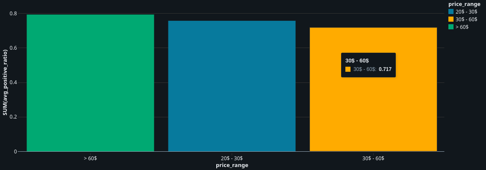

#### 4.3 Top jeux par nombre de propriétaires
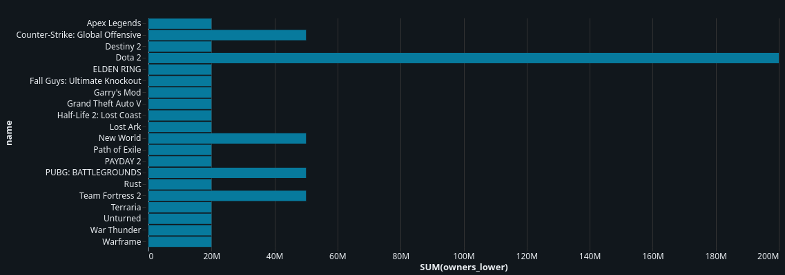

#### 4.4 Jeux multi-plateformes vs popularité
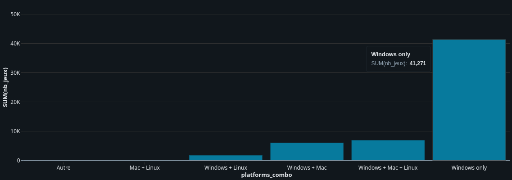

---
🖥️ Aperçu des notebooks sur Databricks
> Les notebooks ont été développés et exécutés sur Databricks Free Edition. Voici un aperçu de l'environnement de travail :
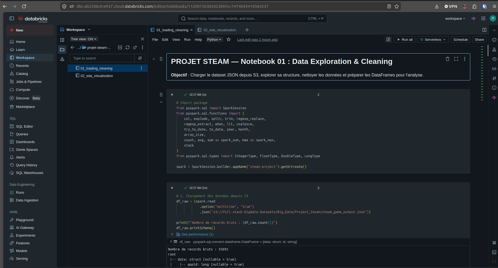

> Vue du Workspace Databricks avec les deux notebooks 01_loading_cleaning et 02_eda_visualization dans le dossier projet-steam.
---

## 🛠️ Stack technique

- **Databricks** (Free Edition)
- **Apache Spark / PySpark**
- **Delta Tables**
- **AWS S3**

---

## 👤 Auteur

Projet réalisé dans le cadre du **Bloc 2 — Big Data** à Jedha Bootcamp.

- By RANJAKASOA Raphaël Marcellin
